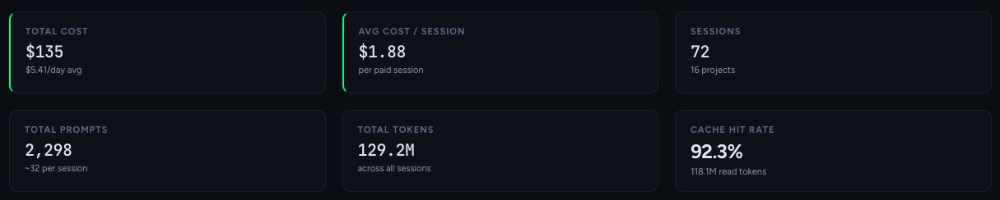
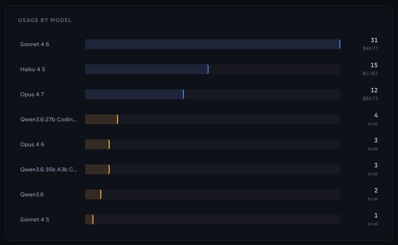

# Token Bleed

**See exactly what Claude Code is costing you. Per session. Per project. Per prompt.**

[](LICENSE)
[](https://www.typescriptlang.org/)

---



---

## Installation

### Quick start (recommended)
```bash
npx token-bleed
```

### Install permanently
```bash
npm install -g token-bleed
token-bleed
```

### Run on login (Mac)
```bash
npm install -g token-bleed
token-bleed install
# Token Bleed now starts automatically.
# Open http://localhost:3847 anytime.
```

### Fix log retention (do this once)
```bash
token-bleed fix-retention
```

---

## The problem

Claude Code is productive. It's also expensive when you're not watching.

It manages context automatically, fires tool calls in the background, and reads files you didn't ask it to read. By the time your Anthropic bill lands, you have no idea which project burned $40 or which prompt pattern is costing you three times what it should.

Token Bleed fixes that. It reads your local session logs and turns them into a real cost dashboard. No API key, no cloud, no telemetry. Your data never leaves your machine.

---

## What it does

### Cost visibility, not estimates

Total spend, daily trends, average session cost, and per-message breakdowns. Filtered by time period. Accurate to Anthropic's published pricing including cache write and cache read rates.

### When you shipped

Your Claude Code sessions rendered as a contribution-style heatmap. See your build cadence at a glance, not just what you spent.


### Project and model breakdown

See which projects are burning the most and which models you're actually using. Drill down from project to session to individual message. Every number is traceable.

| Project Breakdown | Model Usage |
| :---: | :---: |
|  |  |

### Session Compare

Pick any two sessions and diff them side by side. Token counts, cost, cache behavior, tool call volume. Useful when you're testing prompt strategies and want to know which approach is actually cheaper, not just which feels faster.


### Model Compare

Compare two models across the same workload. Input tokens, output tokens, cache hit rate, total cost. Makes the Opus vs Sonnet decision data instead of instinct.

### Cache hit rate tracking

Prompt caching is the biggest lever most builders aren't using correctly. Token Bleed tracks your cache hit rate so you can see whether your workflow is actually taking advantage of it, and by how much.

### Optimization signals

Surfaces patterns in your usage: sessions with no cache hits, high tool call counts, models you're paying Opus prices for on tasks that don't need it.


---

## How it works

Claude Code writes a `.jsonl` file for every session to `~/.claude/projects/`. Token Bleed reads those files on startup, parses token usage and model info from each assistant turn, and computes cost using Anthropic's published pricing.

No network requests. No accounts. Runs at `localhost:3847`.

Data refreshes from disk every 5 minutes or on demand via the Refresh button.

---

## Models supported

Built-in pricing for all current Claude models. Prefix matching handles future versioned IDs automatically.

| Model             | Input | Output | Cache Write | Cache Read |
| ----------------- | ----- | ------ | ----------- | ---------- |
| claude-opus-4-7   | $15   | $75    | $18.75      | $1.50      |
| claude-sonnet-4-6 | $3    | $15    | $3.75       | $0.30      |
| claude-haiku-4-5  | $0.80 | $4     | $1.00       | $0.08      |
| claude-3-5-sonnet | $3    | $15    | $3.75       | $0.30      |
| claude-3-5-haiku  | $0.80 | $4     | $1.00       | $0.08      |
| claude-3-opus     | $15   | $75    | $18.75      | $1.50      |
| claude-3-haiku    | $0.25 | $1.25  | $0.30       | $0.03      |

Prices per million tokens. You can add custom model pricing in Settings.

Local and custom models show usage data but report $0 cost.

---

## Local model quirks

Token Bleed works with any model Claude Code connects to, including local models via Ollama or similar.

One thing to know: local model servers do not implement prompt caching, so they report the full conversation context as `input_tokens` on every turn instead of incremental deltas. This means input token totals for local model sessions will be significantly higher than equivalent Claude sessions and are not directly comparable. Session Compare and Model Compare flag this when a local model is present.

---

## API

The server exposes a REST API if you want to build on top of it.

| Method | Path                         | Description                                             |
| ------ | ---------------------------- | ------------------------------------------------------- |
| GET    | `/api/stats`                 | Global totals and summary                               |
| GET    | `/api/projects`              | Per-project cost and usage                              |
| GET    | `/api/sessions`              | Paginated session list (filterable by project, model)   |
| GET    | `/api/sessions/:id`          | Single session detail                                   |
| GET    | `/api/sessions/:id/messages` | Per-message breakdown for a session                     |
| GET    | `/api/models`                | Per-model aggregated stats                              |
| GET    | `/api/models/comparison`     | Side-by-side stats for two models                       |
| GET    | `/api/daily`                 | Daily cost and activity over time                       |
| GET    | `/api/meta`                  | Date range and cleanup period from your Claude settings |
| GET    | `/api/refresh`               | Invalidate the in-memory cache                          |
| POST   | `/api/settings`              | Update `cleanupPeriodDays` in `~/.claude/settings.json` |

All list endpoints accept a `?since=YYYY-MM-DD` query param to filter by date.

---

## Stack

- **Runtime:** Node.js 18+
- **Server:** [Fastify](https://fastify.dev/)
- **Frontend:** Vanilla TypeScript, no framework

---

## License

MIT. Build with it, fork it, ship it.

---

Built by [Richard Sylvester](https://youtube.com/@MrRichSylvester) · [AI Revenue Club](https://airevenueclub.com)
